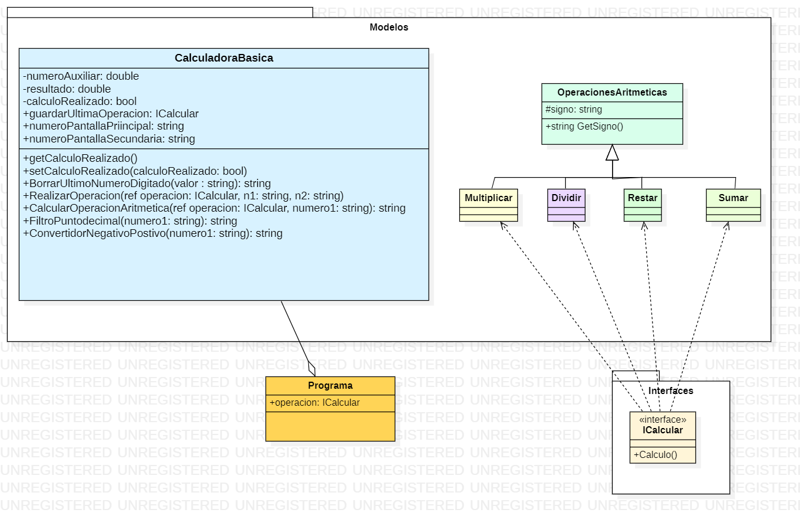

# Calculator_1.0Calculator_1.0
Calculadora sencilla para que podamos hacer sumas, restas, multiplicaciones y divisiones.

## Tecnologias Utilizadas 🛠️
proyecto realizado con C# en el entorno de **WPF**, Windows Presetation Foundation.

## Estado del proyecto ⚙
El proyecto se encuentra en ultimas etapas de proceso de optimización de su código. Estoy verificado si presenta errores, hacerle últimos retoques y ya quedaria listo.

### Diagrama de uml
Representación en el modelo uml de Calculator_1.0

⌨️ con aprecio 🧡 por JonierPachon 😊
